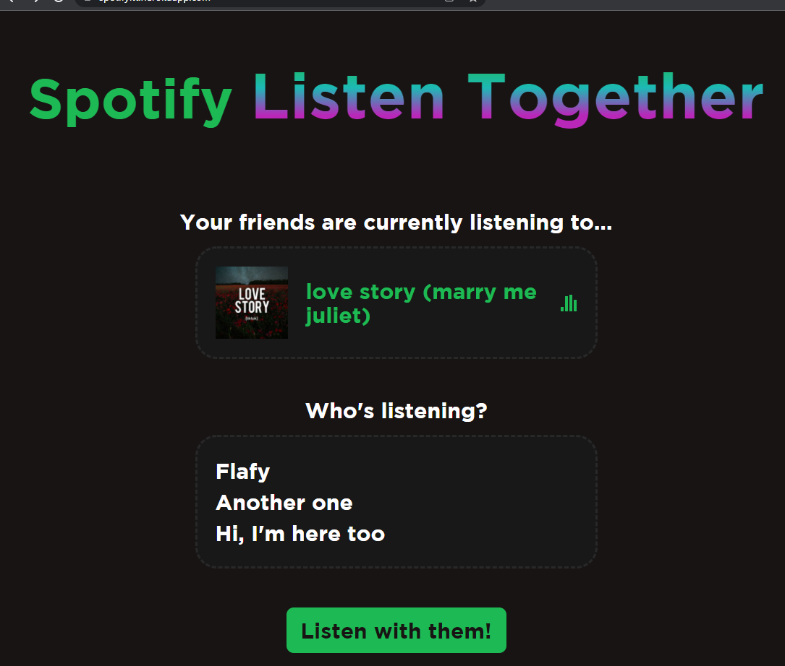

## Usage
Press the "Listen Together" button in the top left to open the extension's menu.

### Creating a Server
To listen together with others, you must first create a server for everyone to join to.
To get started, go to [Spotify Listen Together Server](https://github.com/FlafyDev/spotify-listen-together-server) or host with Heroku.

### Joining a Server
Press "Join a server" in the menu and enter the server's address and your name.

### Playing, Seeking, and Pausing Songs
Only the hosts are able to change, seek, and pause songs. To become a host, press "Request host" in the menu and enter the password set by the server.

### Disconnecting From a Server
Press "Leave the server" in the menu.

## Examples
Example of the website:

## TODOs (For both the client and the server)
- Change "server" to "room". Have multiple rooms per server.
- Fix unexpected behavior when selecting the song that is currently playing.
